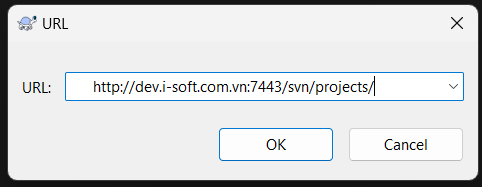
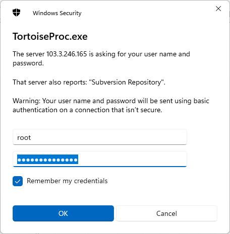

# Triển khai svn client for user

## Cài đặt svn-client truy cập vào svn-server

**Chuẩn bị:**

- Đã có đường dẫn và user truy cập vào svn-server

**Bước 1:**

Nếu chưa có user thì tạo <user> và <pass> cho user truy cập vào thư mục repo

```bash
docker exec -t svn-server htpasswd -b /etc/subversion/passwd <user> <pass>
```

**Bước 2:**

Cài đặt TourtoiseSVN client cho window

dùng CMD:

```shell
winget install TortoiseSVN.TortoiseSVN
```

hoặc truy cập [Downloads · TortoiseSVN](https://tortoisesvn.net/downloads.html) tải về và cài đặt

**Bước 3:**

Dùng phần mềm TourtoisSVN Repository Browser để truy cập

- Mở chương trình


- Nhập URL vào



- Nhập user/pass vào

**User**: email

**Password**: i-soft@123



- Truy cập thành công


Done!
