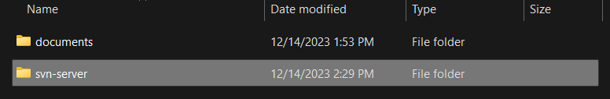
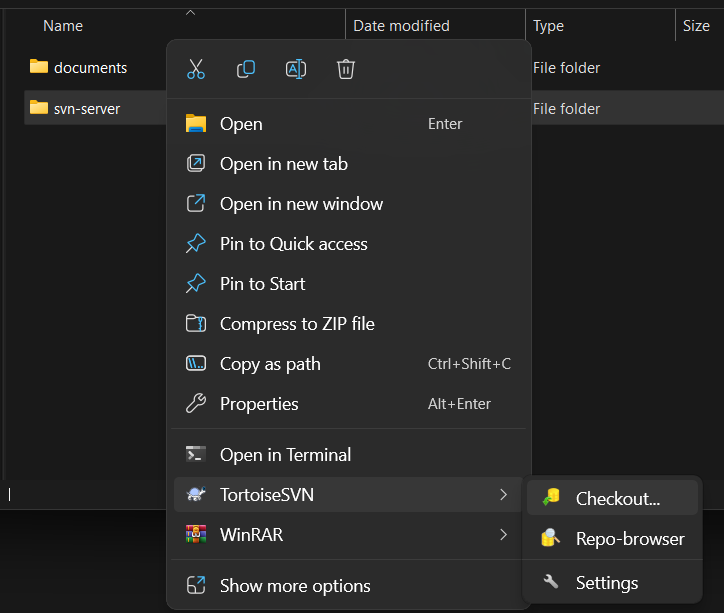
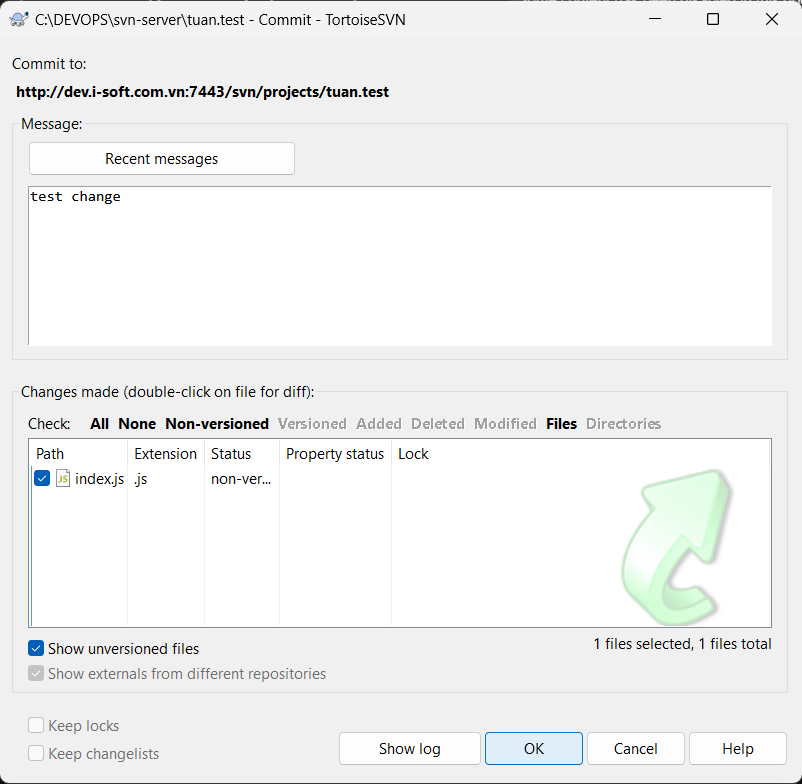
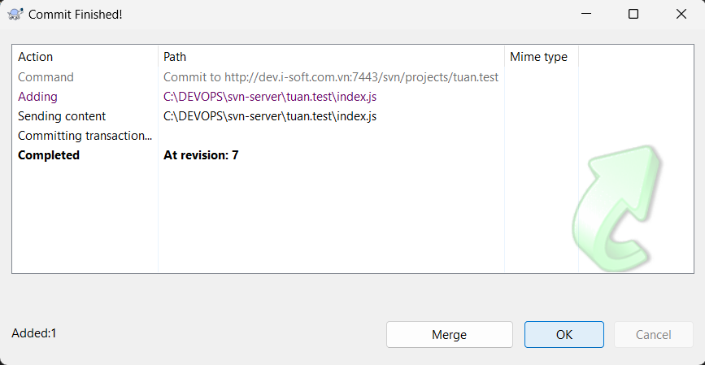
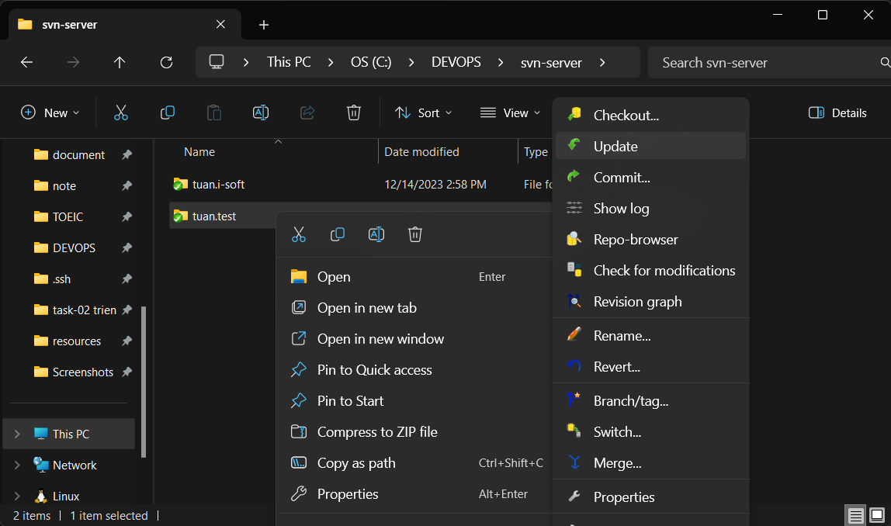
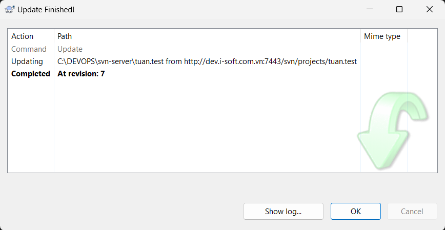

# Hướng dẫn sử dụng server SVN ở các máy client

## Hiểu các lệnh cơ bản của SVN / TortoiseSVN

- `Checkout`: clone repository trên SVN server về thư mục hiện tại.
- `Commit`: gửi các thay đổi từ local lên SVN server.
- `Update`: đồng bộ hóa thư mục ở local với thư mục trên SVN server (thư mục phải được _checkout_ về từ repository trên SVN server).

## Hướng dẫn sử dụng

**Yêu cầu**:

- Đã cài TortoiseSVN.
- Có account để truy cập vào SVN server.

### Clone repository về máy local

Ví dụ ở đây là repository `projects` trên SVN server.

### Bước 1. Tạo thư mục để lưu trữ repository ở local:

Chúng ta có thể tạo thư mục giống tên repository là `projects` hoặc tên bất kỳ.

Ở đây chúng ta đặt là `svn-server`

### Bước 2. Chọn checkout để clone repository về thư mục:

Chuột phải vào thư mục vừa tạo > TortoiseSVN > Checkout...

### Bước 3. Điền repository url và nhấn OK:

Điền url của repository > OK

Checkout Finished! > OK

Sau đó, thư mục hiện tại là thư mục đã clone repository về

### Commit thay đổi từ local lên SVN server

Sau khi thay đổi các file ở thư mục repository ở local, chúng ta làm các bước như sau để gửi những thay đổi lên SVN server.

Ví dụ, chúng ta thêm 1 file `index.js` vào folder `tuan.test`

### Bước 1. Chọn commit để gửi các thay đổi lên server:

Chuột phải vào folder `tuan.test` > TortoiseSVN > Commit...

### Bước 2. Nhập message (nếu cần) và nhấn OK:

Nhập message > tick chọn các file đã thay đổi > OK

### Pull các thay đổi từ SVN server về local

Khi các member khác commit lên máy chủ, chúng ta đồng bộ file giữa server và local bằng command `update`

### Bước 1. Chọn update:

Chuột phải vào file hoặc folder ở local cần đồng bộ với server > TortoiseSVN > Update

Update finished! > Ok

### Bước 2. (nếu có conflict) Giải quyết conflict:

**Lưu ý**: Khi update có thể xảy ra trường hợp conflict. Lúc này, chúng ta chỉ việc giải quyết conflict và `commit` các thay đổi lên lại server như ở trên.
